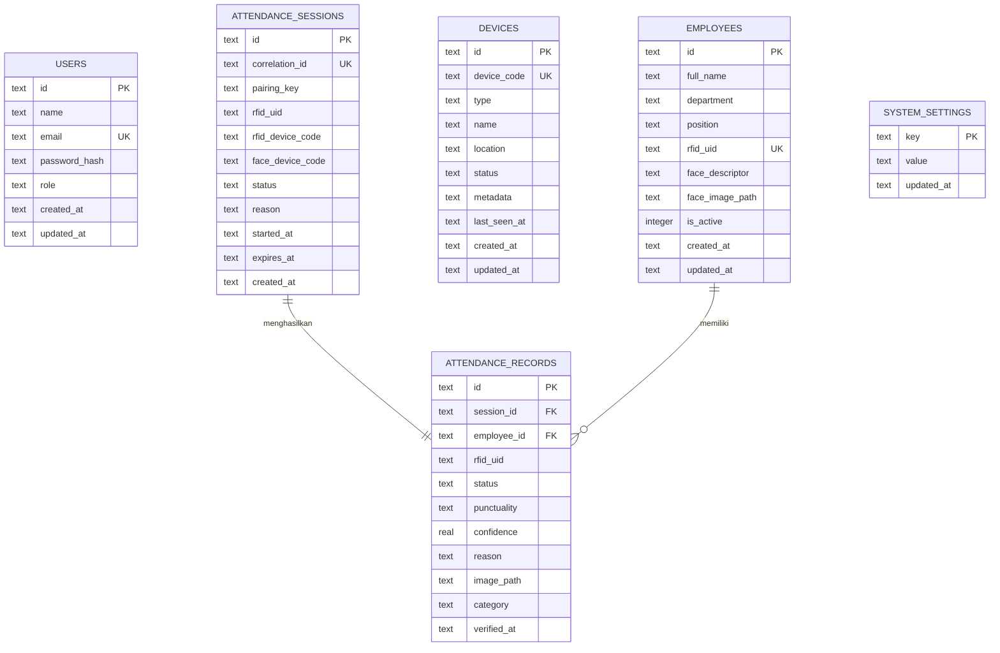

# Dokumentasi Database

## 8.1 Teknologi

Sistem menggunakan **SQL.js** — implementasi JavaScript dari SQLite yang dikompilasi ke WebAssembly. Ini menghilangkan kebutuhan akan server database eksternal.

**Karakteristik Utama:**
- File database tunggal: `storage/rfid_v3.sqlite`
- Eksekusi in-memory dengan persistensi file otomatis
- Mode WAL (Write-Ahead Logging) untuk performa baca konkuren
- Tidak ada dependensi eksternal atau instalasi yang diperlukan
- Otomatis dibuat dan dimigrasi pada first run

## 8.2 Entity Relationship Diagram



## 8.3 Definisi Tabel

### Tabel: `users`

Menyimpan akun administrator dan operator untuk akses sistem.

| Kolom | Tipe | Constraint | Deskripsi |
|-------|------|------------|-----------|
| `id` | TEXT | PRIMARY KEY | UUID v4 |
| `name` | TEXT | NOT NULL | Nama lengkap pengguna |
| `email` | TEXT | UNIQUE, NOT NULL | Email untuk login |
| `password_hash` | TEXT | NOT NULL | Hash bcrypt dari password |
| `role` | TEXT | NOT NULL, DEFAULT 'ADMIN' | Peran: `ADMIN` atau `OPERATOR` |
| `created_at` | TEXT | NOT NULL | Timestamp ISO 8601 |
| `updated_at` | TEXT | NOT NULL | Timestamp ISO 8601 |

**Index:**
- `email` — UNIQUE index untuk lookup login cepat

**Relasi:** Tidak ada (tabel standalone)

---

### Tabel: `employees`

Data master semua karyawan yang terdaftar dalam sistem absensi.

| Kolom | Tipe | Constraint | Deskripsi |
|-------|------|------------|-----------|
| `id` | TEXT | PRIMARY KEY | UUID v4 |
| `full_name` | TEXT | NOT NULL | Nama lengkap karyawan |
| `department` | TEXT | NOT NULL | Departemen/divisi |
| `position` | TEXT | NOT NULL | Jabatan/posisi |
| `rfid_uid` | TEXT | UNIQUE | String hex UID kartu RFID (contoh: `A1B2C3D4`) |
| `face_descriptor` | TEXT | NULLABLE | Array 128 float serialized JSON (embedding Facenet128) |
| `face_image_path` | TEXT | NULLABLE | Path relatif ke foto wajah (contoh: `uploads/abc-123.jpg`) |
| `is_active` | INTEGER | NOT NULL, DEFAULT 1 | 1 = Aktif, 0 = Nonaktif |
| `created_at` | TEXT | NOT NULL | Timestamp ISO 8601 |
| `updated_at` | TEXT | NOT NULL | Timestamp ISO 8601 |

**Index:**
- `rfid_uid` — UNIQUE index untuk lookup RFID cepat

**Relasi:**
- One-to-many dengan `attendance_records` via `employee_id`

---

### Tabel: `devices`

Perangkat keras IoT yang terdaftar untuk monitoring dan pelacakan.

| Kolom | Tipe | Constraint | Deskripsi |
|-------|------|------------|-----------|
| `id` | TEXT | PRIMARY KEY | UUID v4 |
| `device_code` | TEXT | UNIQUE, NOT NULL | Identitas unik perangkat |
| `type` | TEXT | NOT NULL | Tipe: `RFID_READER` / `FACE_SCANNER` / `GATEWAY` |
| `name` | TEXT | NULLABLE | Label perangkat |
| `location` | TEXT | NULLABLE | Lokasi fisik |
| `status` | TEXT | NOT NULL, DEFAULT 'OFFLINE' | Status: `ONLINE` / `OFFLINE` |
| `metadata` | TEXT | NULLABLE | Object JSON (IP address, firmware version, dll) |
| `last_seen_at` | TEXT | NULLABLE | Timestamp ISO 8601 heartbeat terakhir |
| `created_at` | TEXT | NOT NULL | Timestamp ISO 8601 |
| `updated_at` | TEXT | NOT NULL | Timestamp ISO 8601 |

**Index:**
- `device_code` — UNIQUE index untuk lookup perangkat cepat

**Relasi:** Tidak ada (tabel standalone)

---

### Tabel: `attendance_sessions`

Sesi sementara yang menghubungkan pemindaian RFID dengan pengambilan wajah. Ini adalah tabel inti untuk alur absensi dua faktor.

| Kolom | Tipe | Constraint | Deskripsi |
|-------|------|------------|-----------|
| `id` | TEXT | PRIMARY KEY | UUID v4 |
| `correlation_id` | TEXT | UNIQUE | UUID untuk memasangkan event RFID + Face |
| `pairing_key` | TEXT | NULLABLE | Kunci pemasangan (contoh: `ROOM-1`) |
| `rfid_uid` | TEXT | NULLABLE | UID kartu RFID yang memicu sesi |
| `rfid_device_code` | TEXT | NULLABLE | Kode perangkat RFID reader |
| `face_device_code` | TEXT | NULLABLE | Kode perangkat kamera wajah |
| `status` | TEXT | NOT NULL, DEFAULT 'CREATED' | State: `CREATED`, `READY`, `PROCESSING`, `COMPLETED`, `FAILED`, `EXPIRED` |
| `reason` | TEXT | NULLABLE | Alasan kegagalan atau catatan |
| `last_event_at` | TEXT | NULLABLE | Timestamp event terakhir |
| `started_at` | TEXT | NOT NULL | Timestamp ISO 8601 |
| `expires_at` | TEXT | NOT NULL | Timestamp ISO 8601, sesi auto-expire |
| `created_at` | TEXT | NOT NULL | Timestamp ISO 8601 |
| `updated_at` | TEXT | NOT NULL | Timestamp ISO 8601 |

**Index:**
- `correlation_id` — UNIQUE untuk lookup sesi
- `status` — Untuk query sesi pending/ready

**Relasi:**
- One-to-one dengan `attendance_records` via `session_id`

**State Machine Sesi:**

```
CREATED ──► READY ──► PROCESSING ──► COMPLETED
  │                                      │
  └──► EXPIRED                   VALID / INVALID
```

- **CREATED**: State awal saat RFID dipindai
- **READY**: Gambar wajah diterima, siap diverifikasi
- **PROCESSING**: Verifikasi wajah sedang berlangsung
- **COMPLETED**: Verifikasi selesai
- **FAILED**: Verifikasi gagal
- **EXPIRED**: Jendela waktu habis tanpa gambar wajah

---

### Tabel: `attendance_records`

Record absensi final setelah verifikasi berhasil.

| Kolom | Tipe | Constraint | Deskripsi |
|-------|------|------------|-----------|
| `id` | TEXT | PRIMARY KEY | UUID v4 |
| `session_id` | TEXT | UNIQUE, FOREIGN KEY | Referensi ke `attendance_sessions.id` |
| `employee_id` | TEXT | FOREIGN KEY | Referensi ke `employees.id` |
| `rfid_uid` | TEXT | NULLABLE | UID kartu RFID yang digunakan |
| `status` | TEXT | NOT NULL | Status absensi: `VALID` / `INVALID` |
| `category` | TEXT | NOT NULL | `ENTRY` (masuk) / `EXIT` (pulang) |
| `punctuality` | TEXT | NULLABLE | `ON_TIME` (tepat) / `LATE` (terlambat) |
| `confidence` | REAL | NULLABLE | Skor kepercayaan cocok wajah (0.0 - 1.0) |
| `reason` | TEXT | NULLABLE | Alasan status atau catatan |
| `image_path` | TEXT | NULLABLE | Path ke gambar wajah yang di-capture |
| `verified_at` | TEXT | NOT NULL | Timestamp ISO 8601 verifikasi |
| `created_at` | TEXT | NOT NULL | Timestamp ISO 8601 |
| `updated_at` | TEXT | NOT NULL | Timestamp ISO 8601 |

**Index:**
- `session_id` — UNIQUE (satu record per sesi)
- `employee_id` — Untuk query riwayat absensi karyawan
- `verified_at` — Untuk query rentang tanggal
- `status` — Untuk filter valid/invalid

**Relasi:**
- Many-to-one dengan `employees` via `employee_id`
- One-to-one dengan `attendance_sessions` via `session_id`

---

### Tabel: `system_settings`

Key-value store untuk konfigurasi sistem.

| Kolom | Tipe | Constraint | Deskripsi |
|-------|------|------------|-----------|
| `key` | TEXT | PRIMARY KEY | Identitas pengaturan |
| `value` | TEXT | NOT NULL | Nilai pengaturan |
| `updated_at` | TEXT | NOT NULL | Timestamp ISO 8601 |

**Key yang Dikenal:**
| Key | Tipe Nilai | Deskripsi |
|-----|-----------|-----------|
| `entry_start_time` | String (HH:mm) | Waktu mulai masuk (default: `07:00`) |
| `entry_end_time` | String (HH:mm) | Waktu akhir masuk (default: `09:00`) |
| `exit_start_time` | String (HH:mm) | Waktu mulai pulang (default: `16:00`) |
| `exit_end_time` | String (HH:mm) | Waktu akhir pulang (default: `18:00`) |
| `late_threshold_minutes` | Number | Menit setelah entry_end_time dianggap terlambat (default: `15`) |

## 8.4 Inisialisasi & Migrasi Database

Inisialisasi database ditangani di `src/shared/database/sqlite.ts`:

```typescript
// Pada connectSqlite():
// 1. Buka database SQLite dari path file (atau buat jika belum ada)
// 2. Aktifkan mode WAL
// 3. Jalankan CREATE TABLE IF NOT EXISTS untuk 6 tabel
// 4. Sisipkan pengaturan sistem default jika tabel settings kosong
```

**Strategi Migrasi:**
- Tidak ada sistem migrasi formal
- Perubahan schema menggunakan `CREATE TABLE IF NOT EXISTS`
- File `sqlite.ts` berfungsi sebagai source of truth definisi schema

## 8.5 Pola Alur Data

### Alur Penyimpanan Absensi

```
1. ESP8266 POST /api/v1/attendance/rfid
   → INSERT attendance_sessions (status=CREATED)

2. ESP32-CAM POST /api/v1/attendance/face
   → UPDATE attendance_sessions (status=READY)
   → SIMPAN file gambar ke storage/uploads/

3. Verification Service memproses sesi READY
   → UPDATE attendance_sessions (status=PROCESSING)
   → CALL Face Recognition Service
   → INSERT attendance_records (status=VALID|INVALID)
   → UPDATE attendance_sessions (status=COMPLETED)
```

### Pola Query

**Laporan Absensi Harian:**
```sql
SELECT e.full_name, e.department, ar.category, ar.status,
       ar.punctuality, ar.verified_at, ar.confidence
FROM attendance_records ar
JOIN employees e ON e.id = ar.employee_id
WHERE DATE(ar.verified_at) = ?
ORDER BY ar.verified_at DESC
```

**Sesi Aktif (belum diverifikasi):**
```sql
SELECT * FROM attendance_sessions
WHERE status IN ('CREATED', 'READY', 'PROCESSING')
AND expires_at > datetime('now')
ORDER BY created_at DESC
```

**Ringkasan Status Perangkat:**
```sql
SELECT device_code, type, status, last_seen_at
FROM devices
ORDER BY last_seen_at DESC
```
