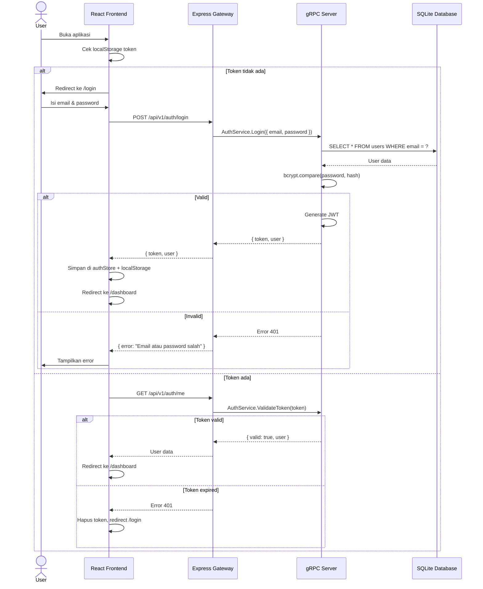
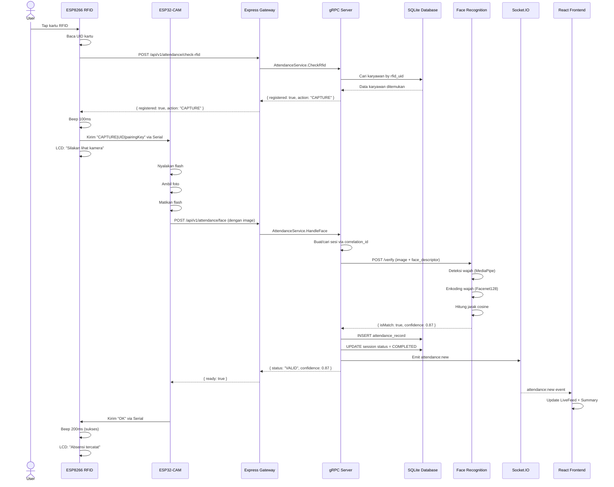
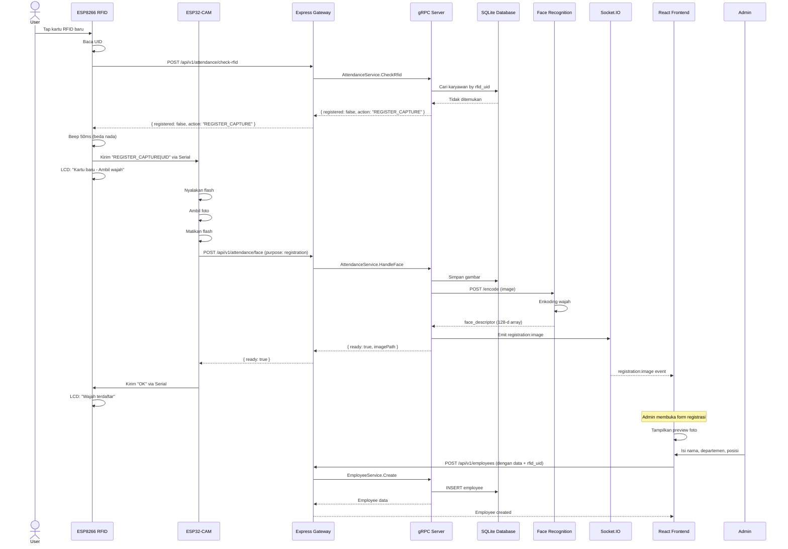
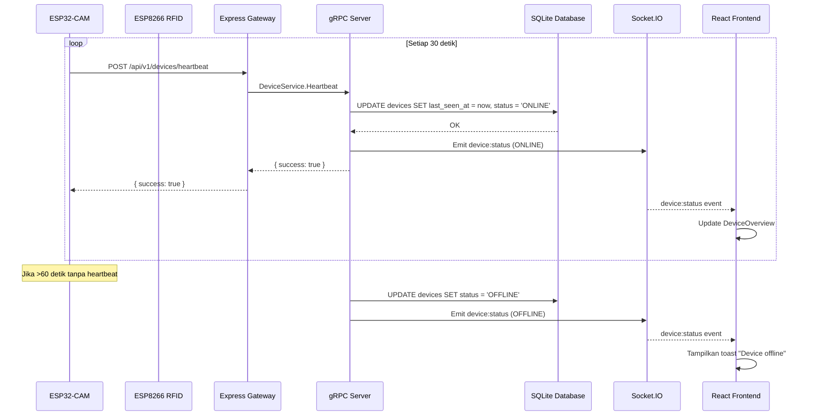
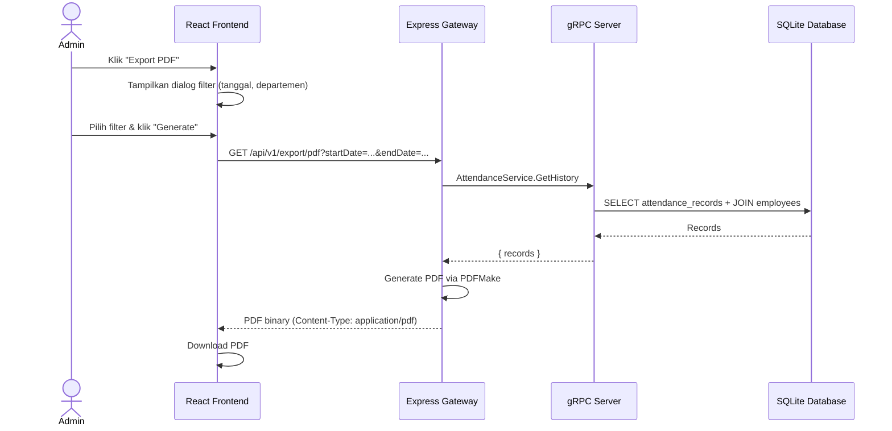
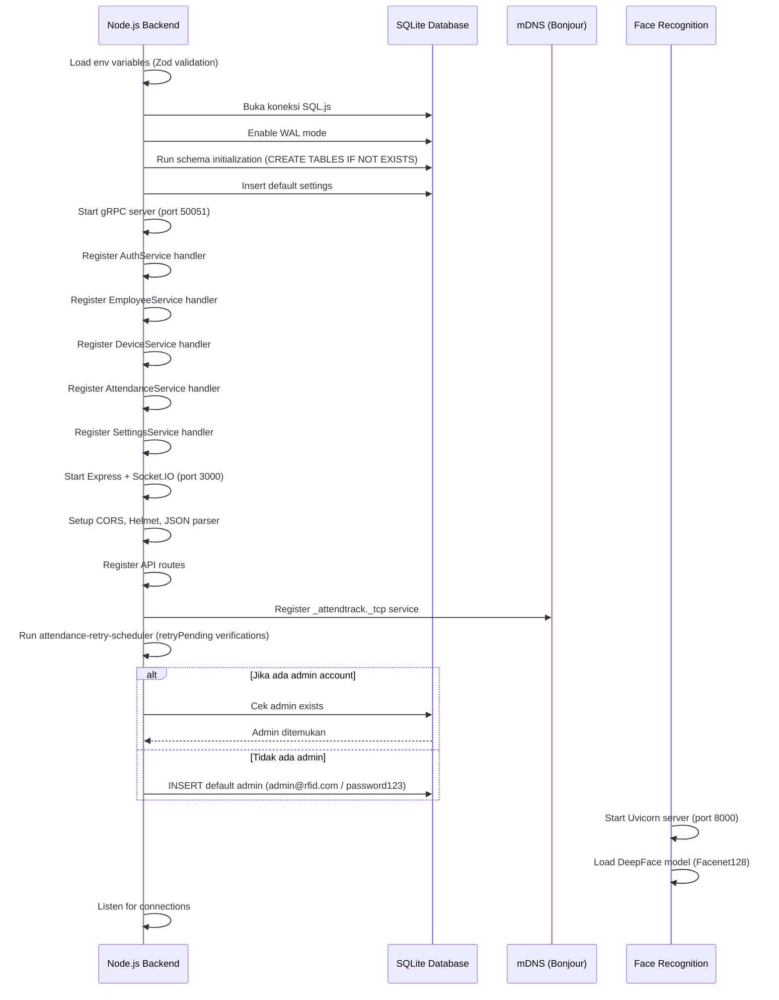

# Diagram Sekuens

## 14.1 Login

```mermaid
sequenceDiagram
    actor User
    participant Frontend as React Frontend
    participant Gateway as Express Gateway
    participant gRPC as gRPC Server
    participant DB as SQLite Database

    User->>Frontend: Buka aplikasi
    Frontend->>Frontend: Cek localStorage token
    alt Token tidak ada
        Frontend->>User: Redirect ke /login
        User->>Frontend: Isi email & password
        Frontend->>Gateway: POST /api/v1/auth/login
        Gateway->>gRPC: AuthService.Login({ email, password })
        gRPC->>DB: SELECT * FROM users WHERE email = ?
        DB-->>gRPC: User data
        gRPC->>gRPC: bcrypt.compare(password, hash)
        alt Valid
            gRPC->>gRPC: Generate JWT
            gRPC-->>Gateway: { token, user }
            Gateway-->>Frontend: { token, user }
            Frontend->>Frontend: Simpan di authStore + localStorage
            Frontend->>Frontend: Redirect ke /dashboard
        else Invalid
            gRPC-->>Gateway: Error 401
            Gateway-->>Frontend: { error: "Email atau password salah" }
            Frontend->>User: Tampilkan error
        end
    else Token ada
        Frontend->>Gateway: GET /api/v1/auth/me
        Gateway->>gRPC: AuthService.ValidateToken(token)
        alt Token valid
            gRPC-->>Gateway: { valid: true, user }
            Gateway-->>Frontend: User data
            Frontend->>Frontend: Redirect ke /dashboard
        else Token expired
            Gateway-->>Frontend: Error 401
            Frontend->>Frontend: Hapus token, redirect /login
        end
    end
```

## 14.2 Absensi RFID (Kartu Terdaftar)

```mermaid
sequenceDiagram
    actor User
    participant ESP8266 as ESP8266 RFID
    participant ESP32 as ESP32-CAM
    participant Gateway as Express Gateway
    participant gRPC as gRPC Server
    participant DB as SQLite Database
    participant Python as Face Recognition
    participant Socket as Socket.IO
    participant Frontend as React Frontend

    User->>ESP8266: Tap kartu RFID
    ESP8266->>ESP8266: Baca UID kartu
    ESP8266->>Gateway: POST /api/v1/attendance/check-rfid
    Gateway->>gRPC: AttendanceService.CheckRfid
    gRPC->>DB: Cari karyawan by rfid_uid
    DB-->>gRPC: Data karyawan ditemukan
    gRPC-->>Gateway: { registered: true, action: "CAPTURE" }
    Gateway-->>ESP8266: { registered: true, action: "CAPTURE" }
    ESP8266->>ESP8266: Beep 100ms
    ESP8266->>ESP32: Kirim "CAPTURE|UID|pairingKey" via Serial
    ESP8266->>ESP8266: LCD: "Silakan lihat kamera"
    ESP32->>ESP32: Nyalakan flash
    ESP32->>ESP32: Ambil foto
    ESP32->>ESP32: Matikan flash
    ESP32->>Gateway: POST /api/v1/attendance/face (dengan image)
    Gateway->>gRPC: AttendanceService.HandleFace
    gRPC->>gRPC: Buat/cari sesi via correlation_id
    gRPC->>Python: POST /verify (image + face_descriptor)
    Python->>Python: Deteksi wajah (MediaPipe)
    Python->>Python: Enkoding wajah (Facenet128)
    Python->>Python: Hitung jarak cosine
    Python-->>gRPC: { isMatch: true, confidence: 0.87 }
    gRPC->>DB: INSERT attendance_record
    gRPC->>DB: UPDATE session status = COMPLETED
    gRPC->>Socket: Emit attendance:new
    gRPC-->>Gateway: { status: "VALID", confidence: 0.87 }
    Gateway-->>ESP32: { ready: true }
    Socket-->>Frontend: attendance:new event
    Frontend->>Frontend: Update LiveFeed + Summary
    ESP32->>ESP8266: Kirim "OK" via Serial
    ESP8266->>ESP8266: Beep 200ms (sukses)
    ESP8266->>ESP8266: LCD: "Absensi tercatat"
```

## 14.3 Registrasi Kartu Baru

```mermaid
sequenceDiagram
    actor User
    participant ESP8266 as ESP8266 RFID
    participant ESP32 as ESP32-CAM
    participant Gateway as Express Gateway
    participant gRPC as gRPC Server
    participant DB as SQLite Database
    participant Python as Face Recognition
    participant Socket as Socket.IO
    participant Frontend as React Frontend

    User->>ESP8266: Tap kartu RFID baru
    ESP8266->>ESP8266: Baca UID
    ESP8266->>Gateway: POST /api/v1/attendance/check-rfid
    Gateway->>gRPC: AttendanceService.CheckRfid
    gRPC->>DB: Cari karyawan by rfid_uid
    DB-->>gRPC: Tidak ditemukan
    gRPC-->>Gateway: { registered: false, action: "REGISTER_CAPTURE" }
    Gateway-->>ESP8266: { registered: false, action: "REGISTER_CAPTURE" }
    ESP8266->>ESP8266: Beep 50ms (beda nada)
    ESP8266->>ESP32: Kirim "REGISTER_CAPTURE|UID" via Serial
    ESP8266->>ESP8266: LCD: "Kartu baru - Ambil wajah"
    ESP32->>ESP32: Nyalakan flash
    ESP32->>ESP32: Ambil foto
    ESP32->>ESP32: Matikan flash
    ESP32->>Gateway: POST /api/v1/attendance/face (purpose: registration)
    Gateway->>gRPC: AttendanceService.HandleFace
    gRPC->>DB: Simpan gambar
    gRPC->>Python: POST /encode (image)
    Python->>Python: Enkoding wajah
    Python-->>gRPC: face_descriptor (128-d array)
    gRPC->>Socket: Emit registration:image
    gRPC-->>Gateway: { ready: true, imagePath }
    Gateway-->>ESP32: { ready: true }
    Socket-->>Frontend: registration:image event
    ESP32->>ESP8266: Kirim "OK" via Serial
    ESP8266->>ESP8266: LCD: "Wajah terdaftar"
    Note over Frontend: Admin membuka form registrasi
    Frontend->>Frontend: Tampilkan preview foto
    Admin->>Frontend: Isi nama, departemen, posisi
    Frontend->>Gateway: POST /api/v1/employees (dengan data + rfid_uid)
    Gateway->>gRPC: EmployeeService.Create
    gRPC->>DB: INSERT employee
    gRPC-->>Gateway: Employee data
    Gateway-->>Frontend: Employee created
```

## 14.4 Heartbeat Perangkat

```mermaid
sequenceDiagram
    participant ESP32 as ESP32-CAM
    participant ESP8266 as ESP8266 RFID
    participant Gateway as Express Gateway
    participant gRPC as gRPC Server
    participant DB as SQLite Database
    participant Socket as Socket.IO
    participant Frontend as React Frontend

    loop Setiap 30 detik
        ESP32->>Gateway: POST /api/v1/devices/heartbeat
        Gateway->>gRPC: DeviceService.Heartbeat
        gRPC->>DB: UPDATE devices SET last_seen_at = now, status = 'ONLINE'
        DB-->>gRPC: OK
        gRPC->>Socket: Emit device:status (ONLINE)
        gRPC-->>Gateway: { success: true }
        Gateway-->>ESP32: { success: true }
        Socket-->>Frontend: device:status event
        Frontend->>Frontend: Update DeviceOverview
    end

    Note over ESP32: Jika >60 detik tanpa heartbeat
    gRPC->>DB: UPDATE devices SET status = 'OFFLINE'
    gRPC->>Socket: Emit device:status (OFFLINE)
    Socket-->>Frontend: device:status event
    Frontend->>Frontend: Tampilkan toast "Device offline"
```

## 14.5 Ekspor PDF

```mermaid
sequenceDiagram
    actor Admin
    participant Frontend as React Frontend
    participant Gateway as Express Gateway
    participant gRPC as gRPC Server
    participant DB as SQLite Database

    Admin->>Frontend: Klik "Export PDF"
    Frontend->>Frontend: Tampilkan dialog filter (tanggal, departemen)
    Admin->>Frontend: Pilih filter & klik "Generate"
    Frontend->>Gateway: GET /api/v1/export/pdf?startDate=...&endDate=...
    Gateway->>gRPC: AttendanceService.GetHistory
    gRPC->>DB: SELECT attendance_records + JOIN employees
    DB-->>gRPC: Records
    gRPC-->>Gateway: { records }
    Gateway->>Gateway: Generate PDF via PDFMake
    Gateway-->>Frontend: PDF binary (Content-Type: application/pdf)
    Frontend->>Frontend: Download PDF
```

## 14.6 Inisialisasi Sistem

```mermaid
sequenceDiagram
    participant Server as Node.js Backend
    participant DB as SQLite Database
    participant mDNS as mDNS (Bonjour)
    participant Python as Face Recognition

    Server->>Server: Load env variables (Zod validation)
    Server->>DB: Buka koneksi SQL.js
    Server->>DB: Enable WAL mode
    Server->>DB: Run schema initialization (CREATE TABLES IF NOT EXISTS)
    Server->>DB: Insert default settings
    Server->>Server: Start gRPC server (port 50051)
    Server->>Server: Register AuthService handler
    Server->>Server: Register EmployeeService handler
    Server->>Server: Register DeviceService handler
    Server->>Server: Register AttendanceService handler
    Server->>Server: Register SettingsService handler
    Server->>Server: Start Express + Socket.IO (port 3000)
    Server->>Server: Setup CORS, Helmet, JSON parser
    Server->>Server: Register API routes
    Server->>mDNS: Register _attendtrack._tcp service
    Server->>Server: Run attendance-retry-scheduler (retryPending verifications)
    alt Jika ada admin account
        Server->>DB: Cek admin exists
        DB-->>Server: Admin ditemukan
    else Tidak ada admin
        Server->>DB: INSERT default admin (admin@rfid.com / password123)
    end
    Python->>Python: Start Uvicorn server (port 8000)
    Python->>Python: Load DeepFace model (Facenet128)
    Server->>Server: Listen for connections
```
