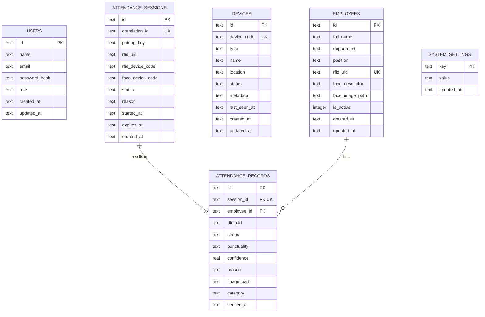

# Dokumentasi Skema Database - RFID Attendance System v3

Dokumen ini berisi struktur tabel database dan Entity Relationship Diagram (ERD) untuk sistem absensi RFID. Struktur ini dirancang untuk mempermudah pemindahan ke Microsoft Word.

## 1. Entity Relationship Diagram (ERD)

---

## 2. Struktur Tabel

Berikut adalah detail struktur tabel dalam format yang mudah disalin ke Microsoft Word.

### Tabel: users
Digunakan untuk menyimpan data akun administrator dan operator sistem.

| Nama Kolom | Tipe Data | Deskripsi |
| :--- | :--- | :--- |
| **id** | TEXT | Primary Key (UUID) |
| **name** | TEXT | Nama lengkap pengguna |
| **email** | TEXT | Alamat email (Unique) |
| **password_hash** | TEXT | Hash password keamanan |
| **role** | TEXT | Peran (ADMIN / OPERATOR) |
| **created_at** | TEXT | Waktu data dibuat |
| **updated_at** | TEXT | Waktu data terakhir diubah |

### Tabel: employees
Data induk karyawan yang terdaftar dalam sistem absensi.

| Nama Kolom | Tipe Data | Deskripsi |
| :--- | :--- | :--- |
| **id** | TEXT | Primary Key (UUID) |
| **full_name** | TEXT | Nama lengkap karyawan |
| **department** | TEXT | Nama departemen/divisi |
| **position** | TEXT | Jabatan karyawan |
| **rfid_uid** | TEXT | ID Unik Kartu RFID (Unique) |
| **face_descriptor**| TEXT | Data vektor wajah (serialized) |
| **face_image_path**| TEXT | Path file foto wajah |
| **is_active** | INTEGER | Status aktif (1: Aktif, 0: Nonaktif) |
| **created_at** | TEXT | Waktu pendaftaran |
| **updated_at** | TEXT | Waktu pembaruan profil |

### Tabel: devices
Daftar perangkat keras (RFID Reader & Face Scanner) yang terhubung.

| Nama Kolom | Tipe Data | Deskripsi |
| :--- | :--- | :--- |
| **id** | TEXT | Primary Key (UUID) |
| **device_code** | TEXT | Kode unik perangkat (Unique) |
| **type** | TEXT | Tipe perangkat (RFID_READER / FACE_SCANNER) |
| **name** | TEXT | Nama label perangkat |
| **location** | TEXT | Lokasi fisik perangkat |
| **status** | TEXT | Status koneksi (ONLINE / OFFLINE) |
| **last_seen_at** | TEXT | Waktu terakhir perangkat aktif |
| **created_at** | TEXT | Waktu pendaftaran perangkat |

### Tabel: attendance_sessions
Tabel sementara untuk sinkronisasi antara pemindaian kartu dan pengenalan wajah.

| Nama Kolom | Tipe Data | Deskripsi |
| :--- | :--- | :--- |
| **id** | TEXT | Primary Key (UUID) |
| **correlation_id** | TEXT | ID untuk tracking antar perangkat |
| **pairing_key** | TEXT | Kunci pemasangan RFID & Wajah |
| **rfid_uid** | TEXT | UID kartu yang dipindai |
| **status** | TEXT | Status sesi (PENDING / SUCCESS / FAILED) |
| **started_at** | TEXT | Waktu sesi dimulai |
| **expires_at** | TEXT | Waktu sesi kadaluarsa |

### Tabel: attendance_records
Log riwayat absensi final yang sudah diverifikasi.

| Nama Kolom | Tipe Data | Deskripsi |
| :--- | :--- | :--- |
| **id** | TEXT | Primary Key (UUID) |
| **session_id** | TEXT | Foreign Key ke attendance_sessions |
| **employee_id** | TEXT | Foreign Key ke employees |
| **rfid_uid** | TEXT | UID kartu yang digunakan |
| **status** | TEXT | Status absensi (PRESENT / LATE / etc) |
| **punctuality** | TEXT | Status ketepatan waktu |
| **confidence** | REAL | Skor akurasi wajah (0.0 - 1.0) |
| **category** | TEXT | Kategori (ENTRY / EXIT) |
| **verified_at** | TEXT | Waktu absensi berhasil diverifikasi |

### Tabel: system_settings
Konfigurasi sistem seperti jam masuk dan jam pulang.

| Nama Kolom | Tipe Data | Deskripsi |
| :--- | :--- | :--- |
| **key** | TEXT | Nama pengaturan (Primary Key) |
| **value** | TEXT | Nilai pengaturan |
| **updated_at** | TEXT | Waktu terakhir diubah |
